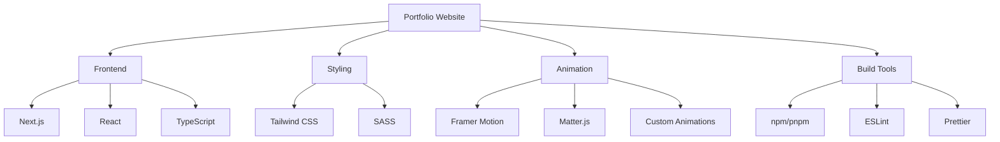
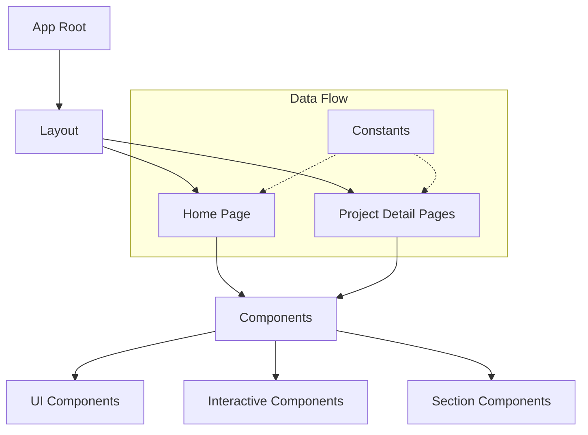
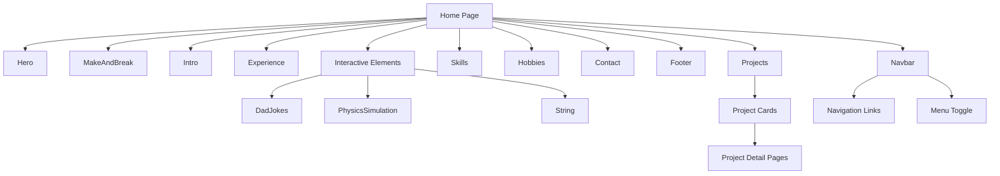
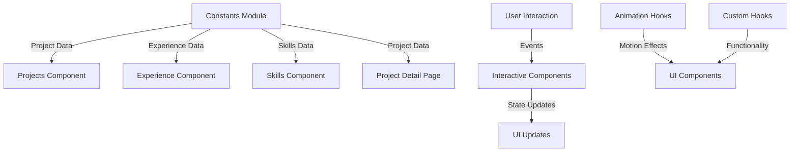
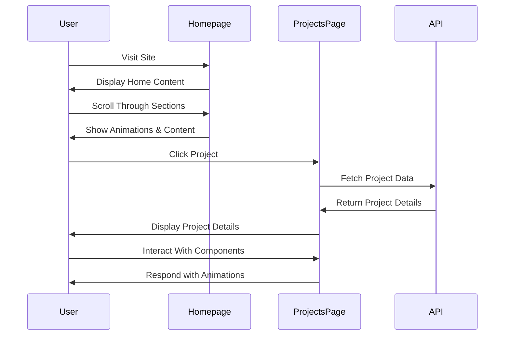

# Modern Portfolio Website

A cutting-edge, interactive portfolio website built with Next.js, React, Framer Motion, and various modern web technologies to showcase projects, skills, and experiences in an engaging manner.

## 📋 Table of Contents

- [Overview](#overview)
- [Features](#features)
- [Tech Stack](#tech-stack)
- [Architecture](#architecture)
- [Project Structure](#project-structure)
- [Installation & Setup](#installation--setup)
- [Usage](#usage)
- [Contributing](#contributing)
- [License](#license)

## 🔍 Overview

This portfolio website showcases professional projects, skills, and experience in an engaging and interactive manner. It features smooth animations, interactive components, and a modern design optimized for performance and user experience.

## ✨ Features

- **Responsive Design**: Fully responsive layout with Tailwind CSS
- **Smooth Animations**: Engaging animations powered by Framer Motion
- **Interactive Components**: Physics simulations, dad jokes generator, and other interactive elements
- **Project Showcase**: Detailed project pages with images, descriptions, and tech stack information
- **Modern UI**: Clean, minimalist design with thoughtful micro-interactions
- **Performance Optimized**: Fast load times and smooth experience even with complex animations
- **SEO Friendly**: Built with Next.js for optimal search engine optimization

## 🛠️ Tech Stack



## 🏗️ Architecture

### High-Level Application Structure



### Component Structure



### Data and State Flow



## 📁 Project Structure

```mermaid
graph TD
    A[Root Directory] --> B[app/]
    A --> C[components/]
    A --> D[constants/]
    A --> E[public/]
    A --> F[Animation/]
    A --> G[hooks/]
    A --> H[lib/]
    
    B --> B1[layout.tsx]
    B --> B2[page.tsx]
    B --> B3[projects/]
    
    B3 --> B3a[[project_name]/]
    B3a --> B3a1[page.tsx]
    B3a --> B3a2[layout.tsx]
    
    C --> C1[UI Components]
    C --> C2[Section Components]
    C --> C3[Interactive Components]
    
    C1 --> C1a[Buttons.tsx]
    C1 --> C1b[Socials.tsx]
    C1 --> C1c[SlidingText.tsx]
    C1 --> C1d[Others...]
    
    C2 --> C2a[Hero.tsx]
    C2 --> C2b[Projects.tsx]
    C2 --> C2c[Experience.tsx]
    C2 --> C2d[Others...]
    
    C3 --> C3a[DadJokes.tsx]
    C3 --> C3b[PhysicsSimulation.tsx]
    C3 --> C3c[String.tsx]
    
    D --> D1[projects.ts]
    D --> D2[experiences.ts]
    D --> D3[skills.ts]
    D --> D4[hobbies.ts]
    
    F --> F1[Boop.js]
    F --> F2[Sparkel.js]
    F --> F3[framerAnimation/]
```

## 📊 Project Workflow



## 🚀 Installation & Setup

1. Clone the repository
```bash
git clone https://github.com/yourusername/portfolio.git
cd portfolio
```

2. Install dependencies
```bash
npm install
# or
pnpm install
```

3. Run the development server
```bash
npm run dev
# or
pnpm dev
```

4. Open [http://localhost:3000](http://localhost:3000) in your browser to see the result.

## 💡 Usage

### Customizing Content

1. Edit project data in `constants/projects.ts`
2. Update experience information in `constants/experiences.ts`
3. Modify skills in `constants/skills.ts`
4. Change personal information as needed throughout the components

### Adding New Projects

Add new project entries to the projects array in `constants/projects.ts`:

```typescript
{
  id: 'project-id',
  title: 'Project Title',
  metadata: ['Category'],
  cover_image: projectImage,
  screenshots: [screenshot1, screenshot2],
  description: 'Project description',
  url: '/projects/project-id',
  features: [
    'Feature 1',
    'Feature 2',
  ],
  skills: {
    Frontend: ['Technology 1', 'Technology 2'],
    Backend: ['Technology 3', 'Technology 4'],
  },
  liveLink: 'https://project-link.com',
  codeLink: 'https://github.com/username/project',
}
```

## 🤝 Contributing

Contributions are welcome! Please feel free to submit a Pull Request.

1. Fork the project
2. Create your feature branch (`git checkout -b feature/AmazingFeature`)
3. Commit your changes (`git commit -m 'Add some AmazingFeature'`)
4. Push to the branch (`git push origin feature/AmazingFeature`)
5. Open a Pull Request

## 📄 License

Distributed under the MIT License. See `LICENSE` for more information.
