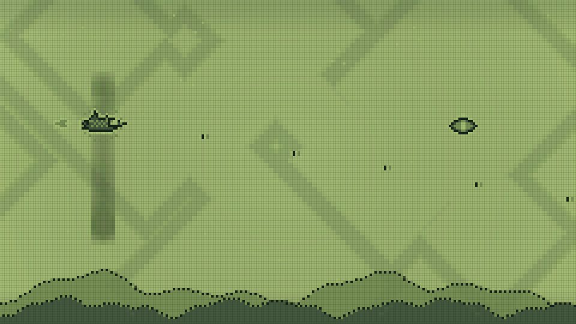
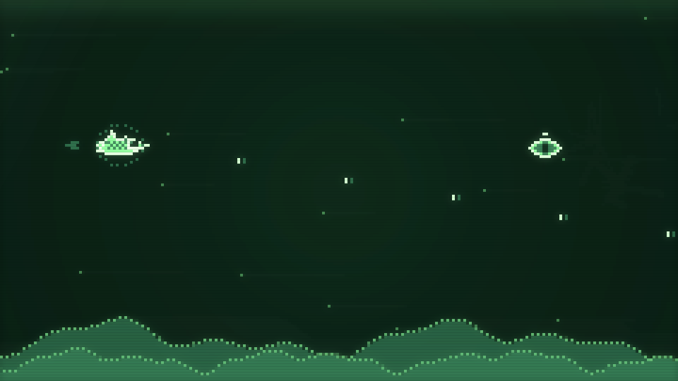
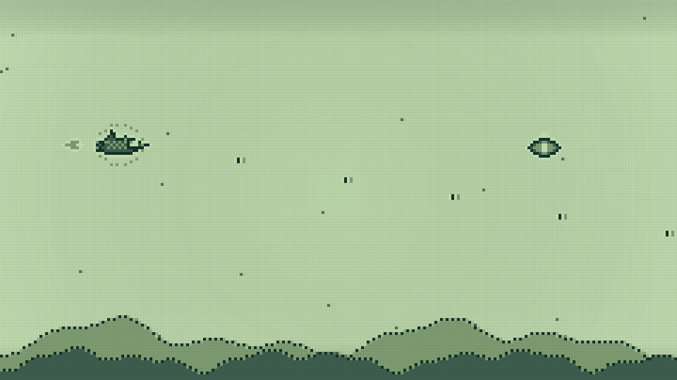

# Pocket Edition: audio and vintage display repair

The previous Pocket component constructed GameAudio without ever calling unlock(). Its SOUND ON label represented a preference, not an active audio engine. The dense LCD grid and animated haze flattened the battlefield; changing panel tint also left sprite pixels in the olive palette.

This change repairs that path and adds a dedicated Vintage CRT preset at `/arcade/space-impact/pocket`.

- Start, Resume, Test sound, and Enable sound activate audio directly from the gesture. Labels reflect the engine state. Unsupported/interrupted audio can be retried without blocking flight.
- Original chiptune music and clearer shot, pickup, impact, pulse, and clear effects use an audio-clock queue (25 ms lookahead, 100 ms horizon), capped at 24 voices through a compressor and conservative master gain. No audio downloads or autoplay on mount.
- Music stops before terminal effects are dispatched, allowing the fanfare/destruction sound to finish. Blur, background, pause, mute, and disposal clear sound immediately. An interruption invalidates pending activation feedback.
- Vintage CRT uses luminous green pixel cores, additive phosphor bloom, horizontal scanlines, a glass inset and surrounding light. The core remains sharp at 240×135 art resolution. The bloom surface is also 240×135; backing buffers are capped at 1440×810 while pointer mapping uses the CSS playfield size. This uses Canvas 2D and CSS, not a WebGL shader.
- Clean/Pocket LCD presets lose the animated haze and use lighter grid texture. Worn retains a restrained weathered effect. Sprites, backgrounds, and clearance borders now use the selected palette consistently.
- Fresh saves default to CRT. Existing preset, palette, mute and zero-volume choices survive; the visible CRT/LCD button makes switching immediate. Missing audio fields use audible defaults instead of becoming zero.
- High contrast or low effects removes bloom and surface overlays. Low flashes and reduced motion suppress transition blanking; settings can scroll on short/narrow displays.

## Review and verification

Independent critic loop: **7.8/10 in round 1 → 8.4/10 in round 2**. The two ranked audio issues (terminal effects cut off and pending feedback after interruption) were fixed. The score covers source and available offline renderer evidence, not a full browser release review. Changes were restored after an interrupted workspace reset and checked again before publication.

- 48 Space Impact tests cover gameplay, eight audio lifecycle/scheduling regressions and actual baked atlas pixel bytes across three palettes.
- Production build, TypeScript and targeted ESLint are run separately because this repository's Next build skips type and lint validation.
- Offline renders exercise the real renderer with a deterministic 630-frame invincible fixture including shots. Native Canvas output does not include the DOM handset, CSS glass, controls or browser compositing.

| Before: Pocket LCD | New: Vintage CRT | Updated: Mint LCD |
| --- | --- | --- |
|  |  |  |

The optional `scripts/space-impact/render-pocket-evidence.cjs` reproduces these captures using `@napi-rs/canvas` in the QA environment. The game has no new runtime dependencies.

```sh
node --import tsx scripts/space-impact/render-pocket-evidence.cjs "$PWD" /tmp/pocket-crt.png crt
```

Browser inspection was blocked by the environment's URL policy. Actual mobile audio activation, hardware speaker output, portrait/landscape controls, settings scrolling, CSS glass appearance and browser frame performance remain unverified. Preview checks should cover Start/Test sound, mute/unmute, background/Resume, clear/death effects, CRT/LCD switching, mint tint and high contrast on a phone.
