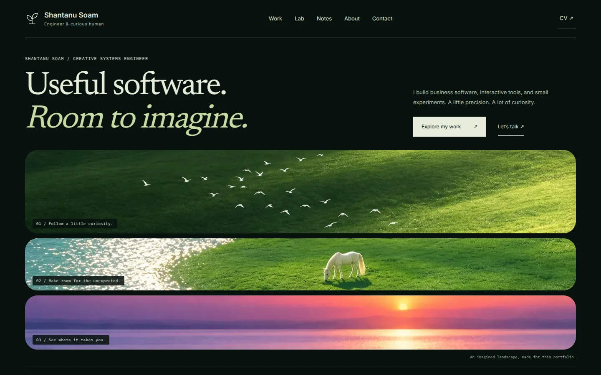
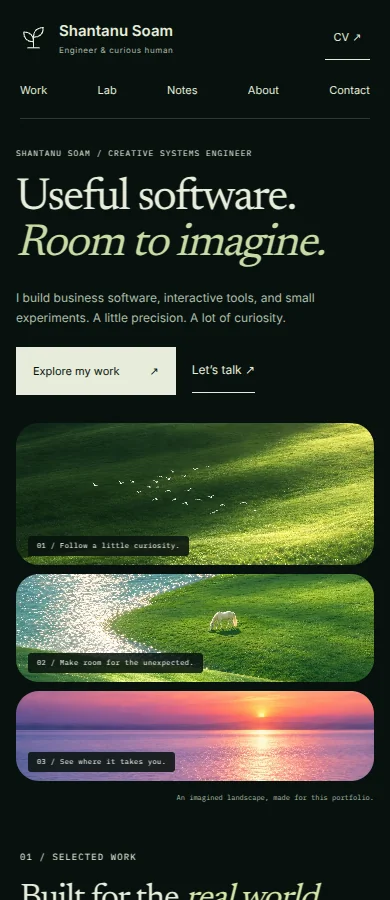

# Workshop validation

## Local preview — 13 September 2026

The homepage was rendered in an isolated Next.js 15.5.21 preview using the repository’s original global CSS, fonts, content data and the new components. The preview layout omits the existing application-wide runtime and analytics; this is not a full-repository production integration test.

- Isolated Next.js production build passed (static homepage; 112 kB first-load JS in this preview only). The preview omitted metadataBase and emitted a localhost warning; the actual repository layout already supplies metadataBase.
- TypeScript check passed for the new homepage components and their data dependencies.
- Four semantic-tree tests passed: descendant preservation, outdent/history immutability, boundary and reversible sibling commands, and 400 supported operations without cycles or lost nodes.
- Chromium 133 / Playwright browser check: homepage HTTP 200, zero page errors.
- No horizontal overflow at 320, 360, 390, 430, 768 and 1440 CSS px.
- All same-page anchor destinations resolved. Existing project/lab/note destinations were checked against repository routes/content, not live destination browsing.
- User-started sketch loaded; keyboard Enter activated Out; Undo and Reset restored the state.
- Reduced motion disabled the hero entrance animation.
- Social-card route returned HTTP 200 and was visually inspected.

## Screenshots

## Measured positions

These are layout positions in the local preview, not performance timings. The compact 130 px mobile illustration deliberately prioritizes the first project. At 320 px, text wrapping pushes the project farther down; no text is clipped.

| Width | Document width | First project title Y |
|---|---|---|
| 320 | 320 | 834 px |
| 360 | 360 | 799 px |
| 390 | 390 | 809 px |
| 430 | 430 | 800 px |
| 768 | 768 | 871 px |
| 1440 | 1440 | 878 px |

## Remaining release checks

Run the full application build and its normal CI checks, inspect the deployed preview, and test actual Safari/Android devices. No production Core Web Vitals, complete accessibility conformance, independent critic score, or live deployment is claimed by these local checks.
